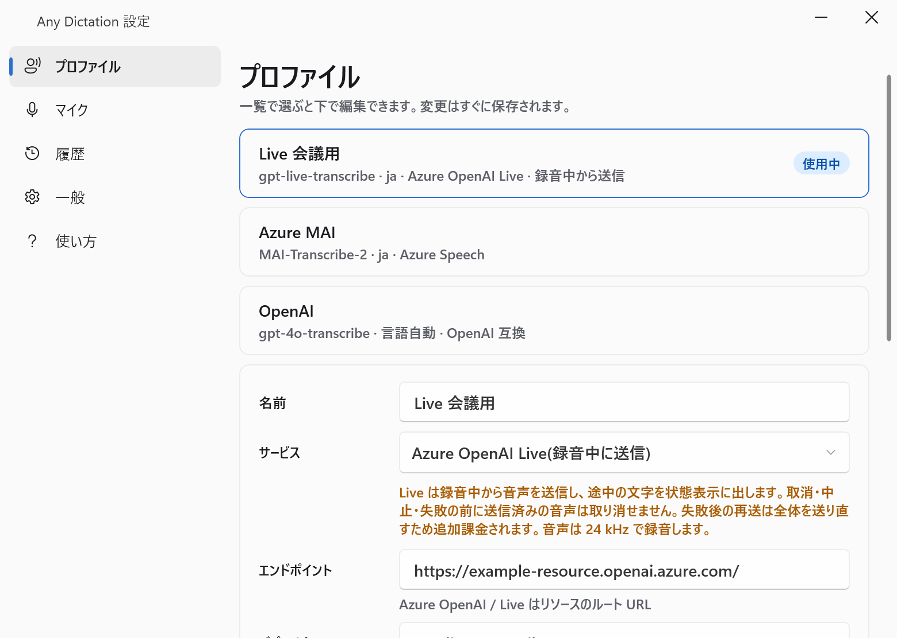
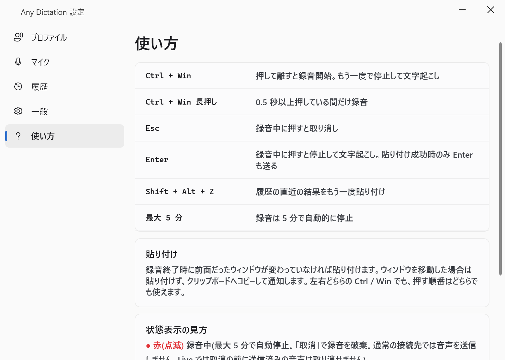

# Any Dictation

Windows 向けの音声入力アプリです。Ctrl + Windows キーで録音を始め、もう一度押すと文字起こしして、作業中のウィンドウへ貼り付けます。タスクトレイに常駐します。

認識には次のサービスを使えます。API キーは各自で用意します。

- Azure Speech の MAI-Transcribe-2
- Azure OpenAI の gpt-transcribe
- Azure OpenAI の gpt-live-transcribe（録音中から送信し、途中の文字を表示する）
- OpenAI と OpenAI 互換の `/audio/transcriptions`（localhost の互換サーバーを含む）



## 動作環境

- Windows 11（x64）で動作を確認しています
- ビルドには .NET 10 SDK が必要です

## インストール

[Releases](https://github.com/diffshare/AnyDictation/releases/latest) から `diffshare.AnyDictation-win-Setup.exe` をダウンロードして実行します。管理者権限は不要で、`%LOCALAPPDATA%\diffshare.AnyDictation` にインストールします。初回の起動では設定画面が開きます。

インストーラーとアプリにはコード署名をしていません。そのため、実行時に「Windows によって PC が保護されました」と表示されることがあります。続ける場合は「詳細情報」を押してから「実行」を押します。

### 更新

インストール版は、起動時と 24 時間ごとに新しい版を確認し、見つかると自動でダウンロードします。準備ができると通知し、トレイのメニューか設定画面の「一般」で「再起動して更新」を選んだとき、またはアプリを終了したときに更新します。録音中、認識中、再送待ちの間は更新しません。自動更新をオフにする設定はありません。更新を避けたい場合は、次の portable 版を使います。

### アンインストール

Windows の「設定」の「アプリ」から Any Dictation をアンインストールします。設定、履歴、ログ（`%LOCALAPPDATA%\AnyDictation`）と、資格情報マネージャーの API キー（`AnyDictation/credential/…`）は残ります。不要なら手動で削除します。

## portable 版のビルドと起動

portable 版は自動更新しません。

```powershell
dotnet publish src/AnyDictation.App -c Release -r win-x64 -p:SelfContained=true -p:PublishSingleFile=true -p:IncludeNativeLibrariesForSelfExtract=true -p:EnableCompressionInSingleFile=true -o dist/self-contained
```

`dist/self-contained/AnyDictation.exe` を起動すると、タスクトレイにアイコンが出ます。初回は設定画面が開きます。

.NET 10 Desktop Runtime が入っている環境では、`-p:SelfContained=false` を指定すると小さい exe（約 1 MB）を作れます。

## 初期設定

1. 設定画面の「プロファイル」タブで、使うサービスの「追加」ボタンを押します。
2. エンドポイント、モデル（Azure OpenAI ではデプロイ名）、言語コード、API キーを入力します。Azure のエンドポイントには、入力欄に表示される例のように自分のリソースの URL を入れます。
3. 「このプロファイルを使用する」を押してから、画面下の「保存」を押します。

API キーは Windows 資格情報マネージャーにだけ保存し、設定ファイルとログには書きません。

## 使い方



- Ctrl と Windows キーを同時に押して離すと録音を開始し、もう一度同じ操作をすると停止して文字起こしします。左右どちらのキーでも、押す順番はどちらでも使えます。
- 録音を終えたときに前面だったウィンドウが、認識が終わるまで前面のままなら、Ctrl+V で貼り付けます。Enter は送りません。途中で別のウィンドウへ移った場合は貼り付けず、クリップボードへコピーして通知します。
- 認識結果は常にクリップボードにも残ります。
- 録音は最大 5 分で自動的に止まります。
- 画面下部に状態表示が出ます。録音中は「取消」、認識中は「中止」、失敗したときは「再送」と「破棄」のボタンがあります。状態表示は入力フォーカスを奪いません。
- 失敗したときは音声をメモリに保持し、「再送」か「破棄」を選ぶまで次の録音はできません。音声はディスクに保存しません。

### Live（gpt-live-transcribe）の注意

Live は録音中から音声を送信します。取消、中止、失敗の前に送った音声は取り消せず、その分の料金がかかります。失敗後の再送は音声全体を送り直します。プロファイルに単価（USD/分）を入力すると、状態表示に概算の費用を出します。

### 設定画面のタブ

| タブ | 内容 |
| --- | --- |
| プロファイル | 接続先、モデル、言語、API キー、使用するプロファイル |
| マイク | 使うマイクの選択と入力テスト |
| 履歴 | 直近 20 件の認識結果（文章のみ）のコピーと削除 |
| 一般 | Windows へのサインイン時の自動起動、直近の Live 利用、保存場所、更新 |
| 使い方 | 操作と状態表示の見方 |

設定、履歴、ログは `%LOCALAPPDATA%\AnyDictation` に保存します。

## 制限

- 管理者権限で動くアプリが前面にあるときは、ホットキーを受け取れないことや、貼り付けできないことがあります。貼り付けできない場合はコピーだけにします。
- Windows メニューが開かないように、Ctrl と Windows キーが揃った時点で未割り当てのキー（VK 0xE8）を 1 回送ります。このキーを独自に割り当てているアプリとは干渉する可能性があります。
- Ctrl+V に別の機能を割り当てているアプリでは、期待どおりに貼り付けられない場合があります。

## 開発

```powershell
dotnet build AnyDictation.slnx -c Release
dotnet test tests/AnyDictation.Tests -c Release
```

設定画面の E2E は、実際のアプリを別プロセスで起動して操作します。ログイン済みの対話デスクトップが必要で、環境変数を指定したときだけ実行します。

```powershell
dotnet build src/AnyDictation.App -c Release
dotnet build tests/AnyDictation.E2E -c Release
$env:ANYDICTATION_RUN_E2E = '1'
$env:ANYDICTATION_E2E_EXE = Join-Path $PWD 'src/AnyDictation.App/bin/Release/net10.0-windows/AnyDictation.exe'
try { dotnet test tests/AnyDictation.E2E -c Release --no-build --filter "FullyQualifiedName~SettingsGuiTests" }
finally { Remove-Item Env:ANYDICTATION_RUN_E2E, Env:ANYDICTATION_E2E_EXE -ErrorAction SilentlyContinue }
```

E2E は `TEMP/AnyDictation.E2E/<GUID>` に隔離した設定を使い、普段の設定、履歴、資格情報には触れません。`ANYDICTATION_E2E_SHOTS` に出力先を指定すると、各画面のスクリーンショットを保存します。

内部設計、通信の形、テストの範囲、実フックの E2E の実行方法は [docs/design.md](docs/design.md) にあります。

### リリース

`main` のコミットに `vX.Y.Z` 形式のタグを push すると、`.github/workflows/release.yml` が単体テスト、publish、Velopack でのパッケージ作成を行い、GitHub Releases に公開します。アプリのバージョンにはタグの値を使います。

## ライセンス

[MIT](LICENSE)
